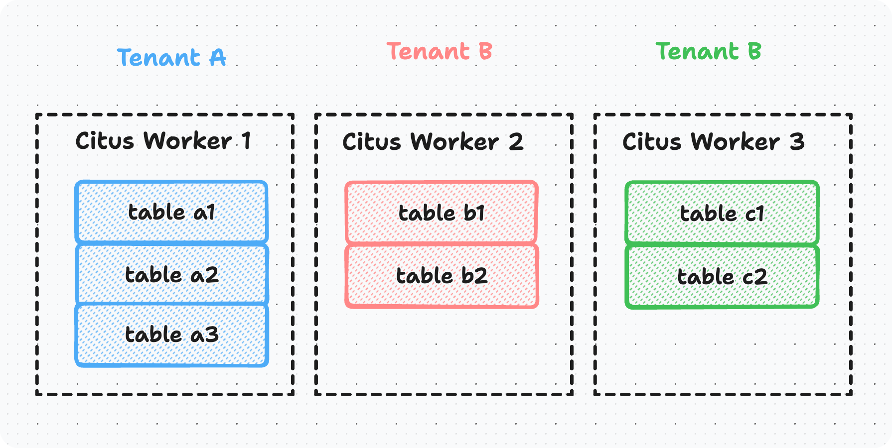

However, when dealing with tables possessed by different tenants with completely distinct structures, especially when
these tables have relatively small data volumes (e.g., an average total row count not exceeding 5000), the direct use of
Citus's distributed tables may not yield the desired results. The query performance may suffer due to the presence of
multiple partitions, especially when these partitions are distributed across different nodes. In such cases, it is often
more effective to store the table on a standard PostgreSQL node.

In this use case, our objective is to achieve tenant data co-location on multiple nodes for single-shard tables, with
each table maintaining only one replica, much like a standalone PostgreSQL instance. We aim to ensure that co-located
data (belonging to the same tenant) resides on the same physical node, all while leveraging Citus's inherent sharding
and rebalancing capabilities.



## How to Implement ?

One approach to achieving this is by encapsulating native PostgreSQL tables into a single-shard Citus distributed table
and using Citus's sharding strategy to schedule it onto the correct nodes. This enables the goal of having a small,
single-node storage table co-located with corresponding Citus distributed tables for other tenants.

We can achieve this behavior in a lightweight manner through the use of a Postgres User-Defined Function (UDF)
Extension.

### Postgres Extension Code

```sql
-- Citus single shard table udf

-- init global tid_mark table
create or replace procedure citus.init_tid_mark()
    language plpgsql
as
$$
declare
    tid_mark_count int;
begin
    -- create global tid_mark table
    create table if not exists citus.tid_mark
    (
        tid text primary key
    );
    -- create distributed table for tid_mark
    select count(*) from citus_tables where table_name = 'citus.tid_mark'::regclass into tid_mark_count;
    if (tid_mark_count = 0) then
        perform create_distributed_table('citus.tid_mark', 'tid');
    end if;
end;
$$;

-- whether the table contains only one single shard
create or replace function citus.is_single_shard_table(tbl_name text)
    returns boolean
    language plpgsql
as
$$
declare
    r boolean;
begin
    select count(shardid) = 1
    from citus_shards
    where table_name = tbl_name::regclass
    into r;
    return r;
end;
$$;


-- whether the single shard table need to be rebalanced
create or replace function citus.is_single_shard_table_colocated(tbl_name text, tid text)
    returns boolean
    language plpgsql
as
$$
declare
    ori_nodename    text;
    ori_nodeport    integer;
    target_nodename text;
    target_nodeport integer;
begin
    if citus.is_single_shard_table(tbl_name) = false then
        return true;
    else
        select nodename, nodeport
        from citus_shards
        where table_name = tbl_name::regclass
        into ori_nodename, ori_nodeport;

        select nodename, nodeport
        from citus_shards
        where shardid = (select shardid
                         from pg_dist_shard
                         where logicalrelid = 'citus.tid_mark'::regclass
                           and (select hashtext(tid)) between shardminvalue::integer and shardmaxvalue::integer
                         limit 1)
        into target_nodename, target_nodeport;
        return not (ori_nodename = target_nodename and ori_nodeport = target_nodeport);
    end if;
end;
$$;

-- co-locate the  single shard table in citus cluster
create or replace function citus.colocate_single_shard_table(tbl_name text, tid text)
    returns record
    language plpgsql
as
$$
declare
    shard_id        bigint;
    ori_nodename    text;
    ori_nodeport    integer;
    target_nodename text;
    target_nodeport integer;
    r               record;
begin
    if citus.is_single_shard_table(tbl_name) = false then
        return r;
    else
        select shardid, nodename, nodeport
        from citus_shards
        where table_name = tbl_name::regclass
        into shard_id, ori_nodename, ori_nodeport;

        select nodename, nodeport
        from citus_shards
        where shardid = (select shardid
                         from pg_dist_shard
                         where logicalrelid = 'citus.tid_mark'::regclass
                           and (select hashtext(tid)) between shardminvalue::integer and shardmaxvalue::integer
                         limit 1)
        into target_nodename, target_nodeport;

        select shard_id, target_nodename, target_nodeport into r;

        if (ori_nodename = target_nodename and ori_nodeport = target_nodeport) then
            return r;
        else
            perform citus_move_shard_placement(shard_id, ori_nodename, ori_nodeport, target_nodename, target_nodeport);
            return r;
        end if;

    end if;
end;
$$;


-- randomly place the single shard table
create or replace function citus.randomly_single_shard_table(tbl_name text)
    returns record
    language plpgsql
as
$$
declare
    shard_id        bigint;
    ori_nodename    text;
    ori_nodeport    integer;
    target_nodename text;
    target_nodeport integer;
    r               record;
begin
    if citus.is_single_shard_table(tbl_name) = false then
        return r;
    else
        select shardid, nodename, nodeport
        from citus_shards
        where table_name = tbl_name::regclass
        into shard_id, ori_nodename, ori_nodeport;

        select node_name,
               node_port
        from citus_get_active_worker_nodes()
        order by random()
        limit 1
        into target_nodename, target_nodeport;

        select shard_id, target_nodename, target_nodeport into r;

        if (ori_nodename = target_nodename and ori_nodeport = target_nodeport) then
            return r;
        else
            perform citus_move_shard_placement(shard_id, ori_nodename, ori_nodeport, target_nodename,
                                               target_nodeport);

            return r;
        end if;
    end if;

end;
$$;


-- create a distributed table with only one shard
create or replace function citus.create_single_shard_distributed_table(tbl_name text)
    returns void
    language plpgsql
as
$$
declare
    ns_space    text;
    rel_name    text;
    has_pri_col boolean;
    shard_col   text;
begin
    select nspname, relname
    from pg_catalog.pg_class as c
             join pg_catalog.pg_namespace as ns
                  on c.relnamespace = ns.oid
    where c.oid = tbl_name::regclass::oid
    into ns_space, rel_name;

    select count(column_name) > 0
    from information_schema.key_column_usage
    where table_catalog = current_database()
      and table_schema = ns_space
      and table_name = rel_name
    into has_pri_col;

    if (has_pri_col) then
        -- using the first primary key column as shard key
        select column_name
        from information_schema.key_column_usage
        where table_catalog = current_database()
          and table_schema = ns_space
          and table_name = rel_name
        order by ordinal_position
        limit 1
        into shard_col;
        perform create_distributed_table(tbl_name, shard_col, shard_count := 1);
    else
        -- using the first column as shard key
        select column_name
        from information_schema.columns
        where table_catalog = current_database()
          and table_schema = ns_space
          and table_name = rel_name
        order by ordinal_position
        limit 1
        into shard_col;
        perform create_distributed_table(tbl_name, shard_col, shard_count := 1);
    end if;
end ;
$$;
```

### Usage

Initialize global distribution identifier after the citus cluster initialization is complete:

```sql
call citus.init_tid_mark()
```

Create a distributed single shard table, there are two shard placement strategies:

- Co-located with tenant-id: `citus.colocate_single_shard_table`
- Random distribution: `citus.randomly_single_shard_table`

```sql
-- create a local table on coordinator node
create table test
(
    f1 text,
    f2 int,
    f3 int
);

-- wrapper the local table 'test' as distributed single shard table
select citus.create_single_shard_distributed_table('test')

-- strategy A: co-located with tenent-id
select citus.colocate_single_shard_table('test', 'f1741e9e-fbbb-41f3-9160-77109a073f75')

-- strategy B: random distributed
select citus.randomly_single_shard_table('test')
```

By default, the first primary key column of the wrapped table or this first normal column (in case it does not contain
any primary key) is used as the shard column of the citus distributed table.

When the citus cluster is scaling out, consider rebalancing distributed single shard table to the correct tenent_id
co-located node:

```sql
select citus.colocate_single_shard_table('test')
```

Of course, the distributed single shard table itself is a citus distributed table and can be converted to a citus native
distributed table at any time.

```sql
-- convert to citus native distributed table
select alter_distributed_table('test', distribution_column := 'f2', shard_count := 32)
```

