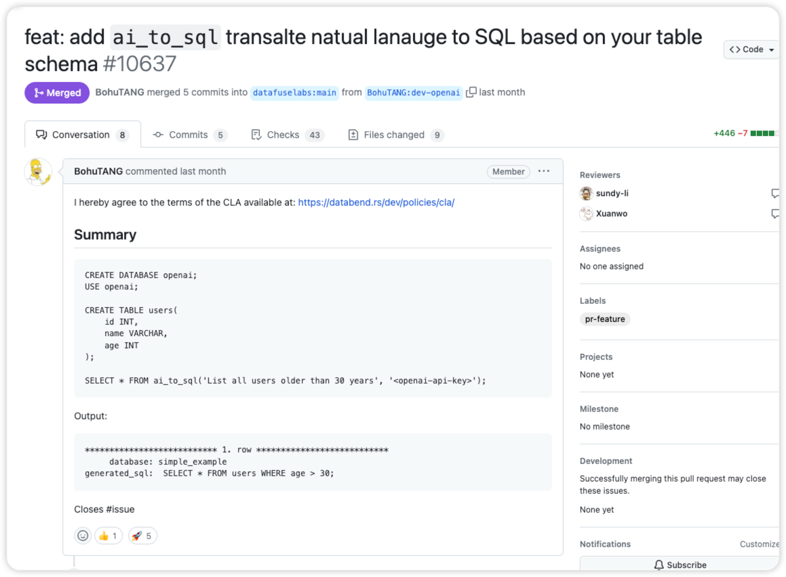
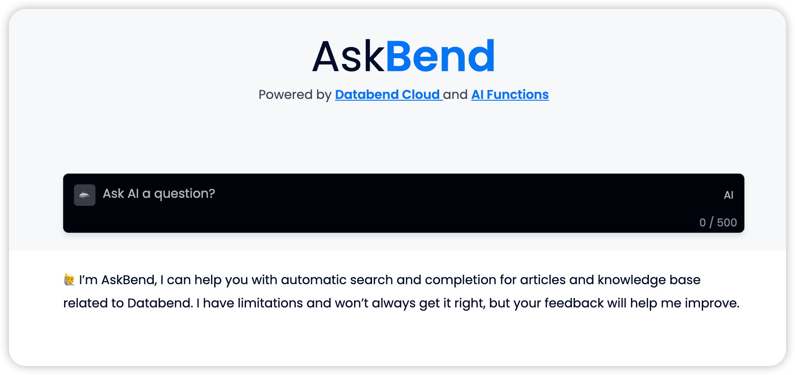
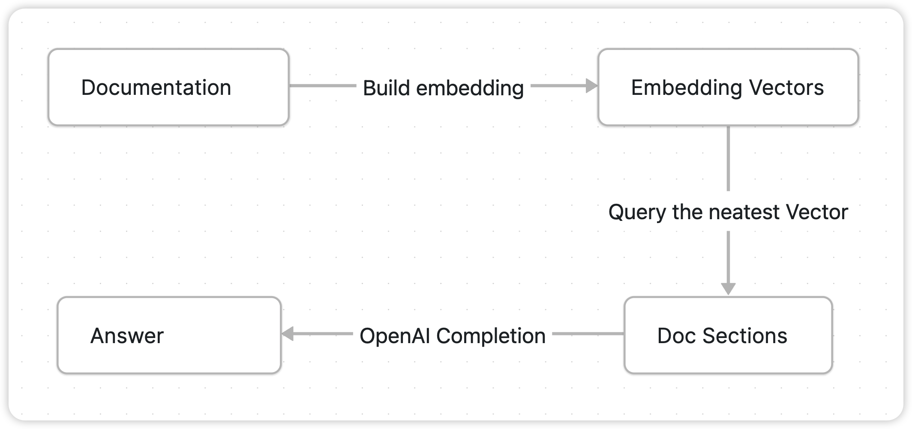

[🦑 Reading on Craft](https://www.craft.do/s/JVKr7FUnuWtJWH)

<br/>

起因是在 3 月的时候刷到 Databend `ai_to_sql` 的一条 PR：

[feat: add ai_to_sql transalte natual lanauge to SQL based on your table schema by BohuTANG · Pull Request #10637 · datafuselabs/databend](https://github.com/datafuselabs/databend/pull/10637)


于是就开始关注 databend 在 GPT-integration 的动向，然后在接下来的几个星期里，databend 以 built-in functoin 的形式陆续实现了一系列基于 OpenAI 的拓展功能。

[AI Functions | Databend](https://databend.rs/doc/sql-functions/ai-functions/)

正当我猜测 Databend 是不是要实现个 ChatDoc 的时候，[Askbend](https://ask.databend.rs/) 上线了，然后作为乐子人的我不出意料玩地很开心。


于是在读了一遍 Askbend 和 Databend AI function 代码的那个晚上，我突发奇想，何不乐上加乐，手搓一个 Postgres 的实现？


<br/>

## AskBend 的实现

[AskBend](https://github.com/datafuselabs/askbend) 的实现文档搜索的过程分为两个主要部份：**Doc Vector Embeddings & Query**。

将文档内容分割为合适长度的小节，计算每个小节的特征向量并存储。用户提问时，计算提问内容的特征向量，并查询余弦距离最近的几个文档小节，组合成 Promt 调用 OpenAI Completion API 获取结果。



其中的关键步骤 Embedding 计算，向量余弦距离计算，自然语言补全依赖 Databend 新实现的几个 AI Function：

- [ai_embedding_vector](https://databend.rs/doc/sql-functions/ai-functions/ai-embedding-vector)
- [ai_text_completion](https://databend.rs/doc/sql-functions/ai-functions/ai-text-completion)
- [cosine_distance](https://databend.rs/doc/sql-functions/ai-functions/ai-cosine-distance)

实际上除了 `osine_distance` 之外，另外两个函数是对 OpenAI API 比较直白的调用封装，虽然 OpenAI 的 embedding 质量一般，但是胜在省事 🤣。

让我们来进一步分析这两个过程的具体实现，~~让我看看.jpg~~。

### 文档嵌入过程


端点代码位于 [https://github.com/datafuselabs/askbend/blob/main/app/bin/ask.rs#L47](https://github.com/datafuselabs/askbend/blob/main/app/bin/ask.rs#L47)，AksBend 实现为一个 CLI-Tool。

#### Step-1: 文档解析

[askbend/markdown.rs at main · datafuselabs/askbend](https://github.com/datafuselabs/askbend/blob/main/app/src/files/markdown.rs#L31)

遍历目标文档目录下的所有 Markdown，将其按照 Heading 分割为内容小节，同时将长度小于 `min_section_len` (默认 1024) 的小节合并到上一个小节，避免过短的内容小节。

这种分割方式十分地暴力，某个小节里很容易出现相关性较低的内容，比如某一个 H1 的小节因为长度过短折叠到了上一个相关性很低 H2 的小节里，更复杂的内容划分算法设计很麻烦，所以 “先实现了再说” 大概是虎哥当时脑海中的想法，这十分地合理（bushi。

#### Step-2: 存储文档小节

[askbend/db.rs at 7babbdb197f573bdb462fedc2a31be206114e8bd · datafuselabs/askbend](https://github.com/datafuselabs/askbend/blob/7babbdb197f573bdb462fedc2a31be206114e8bd/app/src/dal/db.rs#L55)

将 Step-1 的解析结果写入以下结构的表中：

```sql
CREATE TABLE doc (
	path VARCHAR, 
	content VARCHAR, 
	embedding ARRAY(FLOAT32)
);
```

#### Step-3: 计算节选 Embedding

[askbend/db.rs at main · datafuselabs/askbend](https://github.com/datafuselabs/askbend/blob/main/app/src/dal/db.rs#L159)

调用 Databend `ai_embedding_vector` 计算所有小节限定最大内容长度的 vector embedding。

```sql
UPDATE {{ database }}.{{ table }} 
SET embedding = ai_embedding_vector(left(concat(path, content),{{max_content_length}})) WHERE length(embedding)=0"
```

[`ai_embedding_vector`](https://databend.rs/doc/sql-functions/ai-functions/ai-embedding-vector)  实际上是对 [OpenAI Embeddings](https://platform.openai.com/docs/guides/embeddings) API 的调用封装，使用了 `text-embedding-ada-002` ，最大输入 token 是 8191， 输出尺寸为 1536。

Embedding 一种常用的离散特征的高纬向量投射方式，其中最大的问题在于不同生成算法和语料造成的玄学问题，尤其是恶梦一般的调参炼丹过程，自行实现要达到比较好的效果成本不低。

所以原汤化原食，我出钱 OpenAI 出力，美事一桩，况且在这种一次性小规模场景上，也就不到一美元的开销。

### 文档查询过程

.png)

断点代码位于：[askbend/app/src/dal/db.rs#L169](https://github.com/datafuselabs/askbend/blob/7babbdb197f573bdb462fedc2a31be206114e8bd/app/src/dal/db.rs#L169)

#### Step-1：计算 Input 文本的 Embedding

[askbend/db.rs at main · datafuselabs/askbend](https://github.com/datafuselabs/askbend/blob/main/app/src/dal/db.rs#L102)

同样地，实际是通过 [ai_embedding_vector](https://databend.rs/doc/sql-functions/ai-functions/ai-embedding-vector) 调用 [OpenAI Embeddings](https://platform.openai.com/docs/guides/embeddings) API，获取用户输入文本的 Embedding Vector。

#### Step-2: 获取相似内容小节

[askbend/db.rs at main · datafuselabs/askbend](https://github.com/datafuselabs/askbend/blob/main/app/src/dal/db.rs#L182)

获取 Step-1 的 Vector 结果余弦距离最近的 N 个内容小节：

```sql
SELECT
    content,
    distance
FROM
    (
        SELECT
            content,
            cosine_distance({{ query_embedding }}, embedding) AS distance
        FROM
            {{ database }}.{{ table }}
        WHERE
            length(embedding) > 0
            AND length(content) > {{ min_content_lenggth }}
        ORDER BY
            distance ASC
        LIMIT
            {{ top }}
    )
WHERE
    distance <= {{ min_distince }}
```

#### Step-3: 从 OpenAI API 获取结果补全

[askbend/db.rs at main · datafuselabs/askbend](https://github.com/datafuselabs/askbend/blob/main/app/src/dal/db.rs#L194)

文档小节和用户问题组装的 prompt 格式为：

```sql
Documentation sections:
{{context}}

Question:
{{query}}
```

接着通过 Databend [ai_text_completion](https://databend.rs/doc/sql-functions/ai-functions/ai-text-completion) 函数获取补全结果：

```sql
SELECT ai_text_completio("<prompt>")
```

`ai_text_completion`  实际上是对 [Open AI Text Completion](https://platform.openai.com/docs/guides/completion) API 的封装调用，使用 `text-davinci-003` 模型。

个人感觉更换为 [Chat Completion](https://platform.openai.com/docs/guides/chat) API，使用 `gpt-3.5-turbo` 或 `gpt-4` 模型，设计好 prompt 不要让 `gpt` 胡言乱语可以有更好的返回结果。

<br/>

## 中场

以上就是整个 AskBend 的实现过程，虽然这是一个比较赶的项目产物，但是在很短是实现周期内，借助 OpenAI 十分巧妙地实现了一个 SQL-based knowledge，是个很棒的项目😃。

加上 Databend 更早实现 [ai_to_sql](https://databend.rs/doc/sql-functions/ai-functions/ai-to-sql)，整个思路可以在大部份支持向量计算的 Database 里实现出来，尤其是支持 UDF 的 Databse 里可以十分快速地整活，蹭 GPT 的热度可太乐了。

<br/>

## 在 Postgres 上复刻！

作为一个网路乐子人，我当然不能错过这么有意思的整活，于是我花了一个周末在 Postgres 上复刻 AskBend 🤣。

**项目 Github**：[https://github.com/Al-assad/postgres-gpt](https://github.com/Al-assad/postgres-gpt)

Postgres 具备了 2 个基本条件：

- [pgvector](https://github.com/pgvector/pgvector)：拓展支持向量结构的存储，和简单的距离计算算法（余弦/内积距离）；
- pl/python：十分方便的 python udf 编写，openai 提供的 python sdk 直接抄；

实现形式是十分轻量的 Postgres Python UDF，用户开发修改可以直接在线修改相关函数的实现代码，相关的实现基本是像素级一比一抄 Askbend，只不过改进了文档查询为 Chat Completion 方式，设计了以下的 System Prompt：

```sql
You are an assistant with the following background knowledge:
{{documentation}}
```

实际从用户意图的理解上看，要好于 Text Completion 方式，只不过还是有概率发生 Chat Completion 胡言乱语的传统艺能。

<br/>
<br/>
<br/>